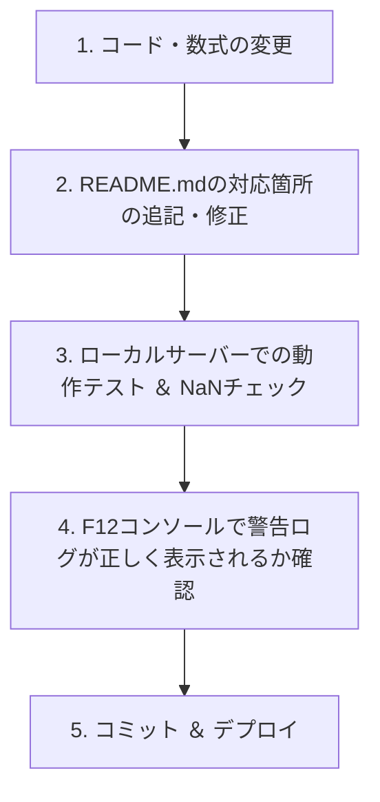

# 💊 薬剤師紹介営業ダッシュボード 仕様書 (Ver. 2.2 - 開発者向け完全版)

本ドキュメントは、薬剤師紹介営業管理ダッシュボード（フロントエンド・モックアップ）の内部仕様、データ構造、数式モデル、およびUIコンポーネントの挙動を定義した開発者向けの完全な仕様書（Spec Sheet）です。

> [!WARNING]
> **仕様変更時の開発者ルール**
> 本ダッシュボードの計算式、データ定義、UI構造を変更した場合は、**必ず本仕様書（README.md）を更新し、実装との完全な同期を維持してください。** 
> 開発者が仕様書のメンテを怠らないよう、ソースコード内コメント、ブラウザコンソール、および画面フッターの3箇所に警告・リマインダーが配置されています。

---

## 🧭 目次
1. [システム概要 ＆ クイックスタート](#1-システム概要-＆-クイックスタート)
2. [データ構造仕様 (data.js)](#2-データ構造仕様-datajs)
3. [9段階予測シミュレーター数式仕様 (app.js)](#3-9段階予測シミュレーター数式仕様-appjs)
4. [UIコンポーネント ＆ ロール別仕様 (index.html)](#4-uiコンポーネント-＆-ロール別仕様-indexhtml)
5. [エリア別市場調査 ＆ エリア定義管理機能 (Ver. 4.0)](#5-エリア別市場調査-＆-エリア定義管理機能-ver-40)
6. [開発者向け仕様書アップデート手順](#6-開発者向け仕様書アップデート手順)

---

## 1. システム概要 ＆ クイックスタート

本ダッシュボードは、薬剤師紹介事業における主要KPI（売上、面談、推薦、成約）の追跡から、先行指標を用いた将来予測、散布図によるメンバー相関分析、AI風指導アクション、市場需給分析までを網羅した高機能シングルページアプリケーション（SPA）です。

Ver. 2.1 では、マネージャーの実務フローに合わせて情報設計を再編しています。左ナビは分析機能名ではなく、以下の順で意思決定が進むように設計されています。

1. `司令塔サマリー`: 全体着地、主要KPI、チーム横並び比較を最初に確認する。
2. `チーム別ファネル`: 選択チームの登録から決定までの歩留まりと次月着地シミュレーションを見る。
3. `メンバー指導`: 行動量と成果効率の相関から、誰にどのタイプの指導を入れるかを判断する。
4. `個別処方箋`: 1on1で使う個人別の強み、課題、具体アクションを確認する。
5. `市場・求人戦略`: 週次・月次の戦略会議向けに、需給、単価、雇用形態別成約ポートフォリオを見る。
6. `エリア定義管理` (NEW): カスタム営業エリアの設定や、47都道府県のグループ分け定義を編集・管理する。

**Ver. 2.2 での拡張機能: 年度の積み上げ（累計）表示仕様**
- **期間フィルターの追加**: 期間フィルターに「年度の積み上げ (累計)」(`fy-total`)が追加されました。
- **KPIカード内動的バッジ**: 各主要KPIカード（確定売上、面談実施、求人推薦、内定承諾）のヘッダー部に「各月の情報 (月次)」（クールブルー）または「年度レベル (累計)」（ネオンプラチナパープル）の動的バッジが同期表示されます。
- **売上トレンドグラフの累計化（S字カーブ）**: 累計期間選択時、グラフが通常の月別凹凸推移から、各月実績を順に足し合わせた「累計S字カーブ」に切り替わり、Y軸ラベルやツールチップにも自動的に「累計」単位が付与されます。
- **チーム別カードの連動**: 期間選択に応じて中段の「チーム別横並び比較」の実績・目標値も multiplier に基づき同期再計算されます。

**Ver. 4.0 での拡張機能: 市場調査（都道府県別・エリア別）の強化 ＆ エリア定義管理画面の新規搭載**
- **市場調査の多角化（サブタブ化）**: 「市場・求人戦略」画面内に、47都道府県の詳細な白地図需給ヒートマップを表示する「都道府県別」サブタブと、ユーザー独自の定義に基づいた営業エリアの需給や比較を表示する「エリア別」サブタブを搭載。
- **エリア別データ動的集計エンジン**: ユーザーが編集したエリア定義（どの都道府県がどのエリアに属するか）に基づき、各エリアの「総求人数」「総求職者数」「平均求人倍率」をリアルタイムに合算・加重平均して再計算・グラフ描画。
- **職種ヒートマップの動的連動**: エリア定義が変更されると、「エリア別職種×求人倍率ヒートマップ」も所属都道府県の職種別データを元にリアルタイムに再集計・再描画されます。
- **永続化とリセット機能**: 変更したエリア設定は `localStorage` に即時記憶・永続化され、リロード後も有効です。「デフォルト設定に戻す」ボタンでいつでも標準の地方区分へリセット可能です。

### 📁 ファイル構成
```bash
/
├── index.html   # 画面レイアウト・静的構造・ロール別ウィジェット定義
├── style.css    # グラスモーフィズム・ネオンスライダー・吹き出しアニメーション
├── data.js      # データベースに相当する詳細な薬剤師紹介モックデータ定義
├── app.js       # ApexCharts描画・シミュレーター方程式・タブ＆ポップオーバー制御
└── README.md    # 本仕様書（開発・設計の唯一の真実）
```

### 🚀 ローカル起動手順
本アプリは依存ライブラリ（Tailwind CSS, ApexCharts, Lucide Icons）をCDN経由でロードするため、インターネット環境が必要です。

**Docker Compose による起動:**
```bash
docker compose up --build
```
起動後、ブラウザで [http://localhost:8000](http://localhost:8000) にアクセスします。

バックグラウンドで起動する場合:
```bash
docker compose up -d --build
```

停止する場合:
```bash
docker compose down
```

**Pythonによる簡易サーバー起動（推奨）:**
```bash
python3 -m http.server 8000
```
起動後、ブラウザで [http://localhost:8000](http://localhost:8000) にアクセスします。

---

## 2. データ構造仕様 (data.js)

`data.js` は、ダッシュボード全体で共有されるデータストアです。以下のプロパティが定義されています。

### ① 全体KPI (`dashboardData.kpis`)
当月累計（5月1日〜5月22日時点）の目標値と実績値、前月比を格納します。
* `revenue`: 確定売上高。紹介手数料平均単価を 125万円 として計算。
* `interviews`: 新規面談実施数。
* `recommendations`: 求人推薦数。
* `offers`: 内定承諾（決定）数。

```javascript
kpis: {
  revenue: { label: "確定売上高 (当月)", value: 23750000, target: 30000000, ... },
  ...
}
```

### ② 営業メンバーデータ (`dashboardData.members`)
CA（キャリアアドバイザー）兼RA（リクルーティングアドバイザー）である営業担当者別の行動指標です。
* `calls`: 架電数
* `connection_rate`: 架電接続率（％）
* `booking_rate`: 面談設定率（％）
* `interviews`: 面談実施数
* `hearing_rate`: ヒアリング充足率（％）
* `proposals_per_int`: 1面談あたり求人提案数（件）
* `consent_rate`: 推薦承諾率（％）
* `recommendations`: 推薦数
* `interviews_set`: 面接設定数
* `prep_rate`: 面接前対策実施率（％）
* `placements`: 決定（成約）数
* `revenue`: 個人の確定売上

### ③ チーム別個別パフォーマンスデータ (`dashboardData.teamsData`)
司令塔サマリーの「チーム別横並び比較」で利用される、各管理グループごとのファネル進捗データおよび週次行動データ（目標 vs 実績）です。
* `group1`, `group2`, `group3`, `kanagawa`, `saitama`, `chiba`, `osaka`, `nagoya` の8チーム分が定義されています。
* **7段階ファネルプロセスの導入**: 各チームの `funnel` オブジェクトは、従来の3つの主要KPIから、より詳細なボトルネック分析が可能な**7段階プロセス（登録: `registrations`、面談設定: `bookings`、面談実施: `interviews`、求人提案: `proposals`、推薦提出: `recommendations`、面接実施: `setups`、成約・決定: `placements`）**へと拡張されています。
* 行動量低下と成約ボトルネックを視覚的に明示するため、`group2`（東京CA 第2グループ）と `chiba`（千葉CA グループ）は大幅な未達傾向に設計されています。
* `warning` ステータスのチームは、面談分母は足りているが決定率が低い、または面接設定率に課題がある中間状態として表現しています。

### ⑤ チーム別ファネル ＆ 動的ボトルネック診断 (`index.html` / `app.js`) [NEW]
* **動的レンダリング**: 選択されたチームのデータをリアルタイムに反映し、7段階のファネル進捗（実績 vs 目標）をダイナミックに描画します。
* **前工程からの移行率（前工程比）の可視化**: 各ステップの間に「前工程比（移行率）」を表示するビジュアルコネクターを動的挿入。目標移行率に対する過不足（差分%）を自動計算し、目標未達の箇所は赤やオレンジの警告バッジ（アラート表示）に切り替わります。
* **動的ボトルネック自動診断エンジン**: チームデータ内で最も目標歩留まりからのマイナス乖離が大きい工程を自動検出し、その原因に応じたプロフェッショナルな改善処方箋（改善の第一アクション）を寸評エリアにリアルタイム生成します。

### ⑥ 日本全国地方別需給データ (`dashboardData.japanMarketData`) [NEW]
日本地図のヒートマップおよび詳細パネルで利用される、8つの地方ブロックごとの薬剤師需給データです。
* **データ構造**: 各地方（`hokkaido`, `tohoku`, `kanto`, `chubu`, `kinki`, `chugoku`, `shikoku`, `kyushu`）ごとに以下を格納します：
  * `name`: 地方名（文字列）
  * `ratio`: 求人倍率（求人数 / 求職者数、数値）
  * `demand`: 有効求人数（数値）
  * `supply`: 登録求職者数（数値）
  * `status`: 需給ステータス（`seller-extreme`, `seller`, `seller-light`, `balance`, `buyer`）
  * `desc`: 地域ごとの詳細な需給概況（文字列）
  * `action`: キャリアアドバイザー（CA）やリクルーティングアドバイザー（RA）が取るべき具体的な営業攻略アクション（戦術的処方箋、文字列）


---

## 3. 9段階予測シミュレーター数式仕様 (app.js)

本ダッシュボードの目玉機能である「先行指標予測シミュレーター」は、翌月の売上と成約件数を予測するため、架電から成約に至る**9つのプロセス（9段階スライダー）**を精緻に連動させた数学的モデルを搭載しています。

### ⚙️ 9つの先行指標スライダー（状態変数）
| スライダー名 | スライダーID | 変数名 | 初期値 (既定値) | 物理的意味 |
| :--- | :--- | :--- | :---: | :--- |
| ① 新規架電数 | `slider-calls` | `calls` | `450` 回 | CAによる当月の新規架電ボリューム |
| ② 架電接続率 | `slider-connection` | `connection` | `34` % | 架電から求職者と会話が繋がった割合 |
| ③ 面談設定率 | `slider-booking` | `booking` | `22` % | 接続した求職者から面談を設定できた割合 |
| ④ ヒアリング率 | `slider-hearing` | `hearing` | `69` % | 希望条件や転職意向を深く握れた割合 |
| ⑤ 求人提案数 | `slider-proposal` | `proposal` | `4.2` 件 | 1回の面談あたりに打診・提案した求人数 |
| ⑥ 推薦承諾率 | `slider-consent` | `consent` | `56` % | 提案求人のうち、推薦に合意してくれた割合 |
| ⑦ 面接設定率 | `slider-setup` | `setup` | `47` % | 推薦から企業側での面接調整に移行できた割合 |
| ⑧ 対策実施率 | `slider-prep` | `prep` | `57` % | 面接前に模擬面接やレジュメ添削を実施した割合 |
| ⑨ 内定承諾率 | `slider-close` | `close` | `40` % | 面接実施から最終決定（入社承諾）に至った割合 |

---

### 📐 予測計算アルゴリズム ＆ キャリブレーション数式
`app.js` 内の `updateSimulation()` 関数で実行される予測算出方程式は以下の通りです。

#### 1. 月次面談数の算出（週次から月次への換算）
$$\text{週次面談実施数} = \text{calls} \times \frac{\text{connection}}{100} \times \frac{\text{booking}}{100}$$
$$\text{月次面談実施数} = \text{週次面談実施数} \times 4.333 \quad (\text{1ヶ月} = 4.333\text{週換算})$$

#### 2. 歩留まり率への変換と二次補正
既存のチーム平均実績歩留まり率を完全に再現（面談→提案：83.1%、提案→推薦：78.0%、推薦→面接：47.8%、面接→決定：43.2%）するため、以下のキャリブレーション用の調整スケーリング関数を用います。

* **提案移行率（Proposal Rate）:**
  $$\text{proposalRate} = \frac{\text{hearing} + 222}{350} \quad (\text{初期値 } 69\% \rightarrow 83.1\%)$$
* **推薦承諾率（Consent Rate）:**
  $$\text{consentRate} = \frac{\text{consent} + 100}{200} \quad (\text{初期値 } 56\% \rightarrow 78.0\%)$$
* **推薦後面接設定率（Setup Rate）:**
  $$\text{setupRate} = \frac{\text{setup} + 50}{202.9} \quad (\text{初期値 } 47\% \rightarrow 47.8\%)$$
* **面接後内定承諾率（Close Rate）:**
  $$\text{closeRate} = \frac{\text{close} + 11.6}{119.4} \quad (\text{初期値 } 40\% \rightarrow 43.2\%)$$
* **面接前対策の二次効果（Prep Factor）:**
  $$\text{prepFactor} = \frac{\text{prep} + 100}{157} \quad (\text{初期値 } 57\% \rightarrow 1.00)$$
* **提案ボリューム効果（Proposal Factor）:**
  $$\text{proposalFactor} = \frac{\text{proposal} + 2}{6.2} \quad (\text{初期値 } 4.2 \rightarrow 1.00)$$

#### 3. 予測決定数（Placements）と売上（Revenue）の算出
$$\text{予測決定数} = \text{月次面談実施数} \times \text{proposalRate} \times \text{consentRate} \times \text{setupRate} \times \text{closeRate} \times \text{prepFactor} \times \text{proposalFactor} \times 0.9718$$
*(※ $0.9718$ は初期状態で予測決定数がぴったり **19.0件** となるように施された数学的最終調整係数です)*

$$\text{予測売上高} = \text{予測決定数} \times 1,250,000\text{円} \quad (\text{平均成約単価 } 125\text{万円換算})$$

#### 🧪 再現性テストシナリオ
1. **初期値状態**: 予測決定数 = **19.0件** / 予測売上高 = **23.8百万円**
2. **アクション品質向上シナリオ（歩留まり改善）**:
   * ヒアリング率を `69%` $\rightarrow$ `85%` に向上
   * 内定承諾率を `40%` $\rightarrow$ `48%` に向上
   * **結果**: 予測売上高が **29.0百万円** となり、初期値から **+5.2百万円**（予測決定数 **+4.16件**）の増加が数式通り正確にシミュレーションされます。

---

## 4. UIコンポーネント ＆ ロール別仕様 (index.html)

本ダッシュボードは、利用者の職位・役割（ロール）に応じた情報提供を行えるよう、切り替え機能とインタラクティブ機能を有しています。

### 👥 利用者（ロール）の定義
* **マネージャー (Management)**: 経営層や統括者向け。マクロな予算達成率、RA・CA向けの施策インセンティブ承認処理などの意思決定ツールを表示。
* **チームリーダー (Leader Coaching)**: グループ・チームの管理職向け。メンバー（鈴木CAなど）の歩留まり低迷アラート（量はあるが質が低い『ガチャ打ち』の検知）を表示。
* **現場営業 (Sales Rep)**: CA/RA担当者向け。本日のアプローチ優先事項を表示。

### ⚙️ インタラクティブUIの挙動
1. **画面ヘッダーと表示ラベルの連動**:
   * `teamSelector`、期間ボタン、タブ切り替えに応じて `updatePageContext()` が実行され、ヘッダータイトルやチーム別ファネルの表示対象ラベルが動的に同期します。
4. **チーム別パフォーマンス横並び比較セクション**:
   * 司令塔サマリー中央に、全8チームのファネル進捗および週次行動量の目標 vs 実績が横並びで表示されます。
   * チームカードとミニ棒グラフは `dashboardData.teamsData` から `renderTeamComparison()` と `createTeamMiniBarChart()` によって動的生成されます。
   * 低パフォーマンスのチーム（第2グループ）は、ファネル進捗バーが警告の赤色で強調表示され、かつ週次行動量の目標に対する大きな未達がミニグラフから一目で確認できます。
   * **詳細分析への連携**: カード下部の「このチームのファネルを見る」ボタンをクリックすると、左サイドバーの「管理チーム（`teamSelector`）」が自動で該当チームに切り替わり、`チーム別ファネル` タブへ遷移して、最上部へスムーズに自動スクロール（スマートスクロール）されます。
5. **日本全国 売り手/買い手 需給ヒートマップ (NEW)**:
    * 「市場・求人戦略」タブの最上部に、未来的な幾何学的ポリゴンで描かれた日本地図SVGを新規搭載。
    * **直感的なヒートマップカラー**: 求人倍率に基づき、極度不足の「超売り手市場」はネオンローズレッド、不足の「売り手市場」はネオンオレンジ、均衡はネオンシアン、充足の「買い手市場」はクールブルーなどのネオン光彩で色分け。
    * **地方ブロック連動の攻略パネル**: 地図上の地方ブロック（北海道・東北・関東・中部・近畿・中国・四国・九州沖縄）をクリックすると、右側の詳細パネルがスムーズに連動して切り替わり、求人倍率の詳細数値やエリア概況、営業攻略のための戦術処方箋を瞬時に表示。
    * **沖縄インセット**: 九州ブロックに属する沖縄県は、地図左下の境界線付きインセット領域に専用のポリゴンで配置し、クリック・ホバー時に九州本土と完全に同期。

---

## 5. エリア別市場調査 ＆ エリア定義管理機能 (Ver. 4.0)

Ver. 4.0 では、ユーザー独自の営業エリアに合わせた求人需給の分析と、その定義を管理者がいつでも変更できるシステムを実装しました。

### ① エリア集計 ＆ 加重平均アルゴリズム
エリア定義は `localStorage` に保存され、`calculateAreaData()` 関数によりリアルタイムに全都道府県の求人（demand）と求職者（supply）が合算されます。

* **エリア全体の求人倍率算出式:**
  $$\text{エリア平均求人倍率} = \frac{\sum_{p \in \text{AreaPrefs}} \text{demand}_p}{\sum_{p \in \text{AreaPrefs}} \text{supply}_p}$$
  
* **エリア需給ステータス基準:**
  * $\text{倍率} \ge 2.5$：`seller-extreme` (超売り手市場・極端な不足) $\rightarrow$ ネオンローズ
  * $1.8 \le \text{倍率} < 2.5$：`seller` (売り手市場・人員不足) $\rightarrow$ ネオンゴールド
  * $1.2 \le \text{倍率} < 1.8$：`seller-light` (やや不足・一部採用難) $\rightarrow$ ネオンシアン
  * $0.9 \le \text{倍率} < 1.2$：`balance` (均衡市場) $\rightarrow$ グレー
  * $\text{倍率} < 0.9$：`buyer` (買い手市場・充足) $\rightarrow$ クールブルー

### ② 職種ヒートマップの動的シミュレーション
エリアに属する都道府県の職種別データを集計する際、都道府県の基本倍率に一定のランダムノイズを付与するシミュレータ `getPrefJobsData()` を搭載。これにより、エリアの構成メンバーが変わるたびに、ヒートマップ全体の需給バランスが生きているように動的に再構築されます。

### ③ エリア定義管理 UI
* **左ペイン**: 定義されているエリア一覧、エリアの新規作成・削除、リアルタイムな名称編集。
* **右ペイン**: 地方ごとに折りたたまれたアコーディオン。各都道府県の横のドロップダウンから所属エリアを排他的に選択・マッピング。
* **データ保存処理**: 「保存ボタン」をクリックした時点で `localStorage` に仮状態（`tempAreas`）を確定書き込みし、`renderAll()` を起動してダッシュボードを自動アップデートします。

---

## 6. 開発者向け仕様書アップデート手順

仕様変更（数式の修正、変数の追加、新規タブの実装など）を行う際、仕様書とコードの乖離を防ぐためのフローは以下の通りです。



### 🚨 開発者向けリマインダーの配置場所
開発者が仕様書の更新を忘れないよう、システム内の以下の箇所に厳重なリマインダー（注意書き）が埋め込まれています。

1. **HTMLソースヘッダー (`index.html`)**:
   ファイルの先頭に仕様書メンテが義務であることをコメントとして明記。
2. **JavaScriptソースヘッダー (`app.js`)**:
   メインロジックの最上部にREADME.md更新の必須ルールをコメントとして明記。
3. **ブラウザデベロッパーコンソール警告 (`app.js`)**:
   ダッシュボード起動時に、F12デベロッパーコンソールに赤い警告テキストを出力。
4. **画面固定フッターバッジ (`index.html`)**:
   ダッシュボードの右下（z-index 9999）に、仕様書へのハイパーリンクを含んだ固定型の警告パネルを常時描画。
